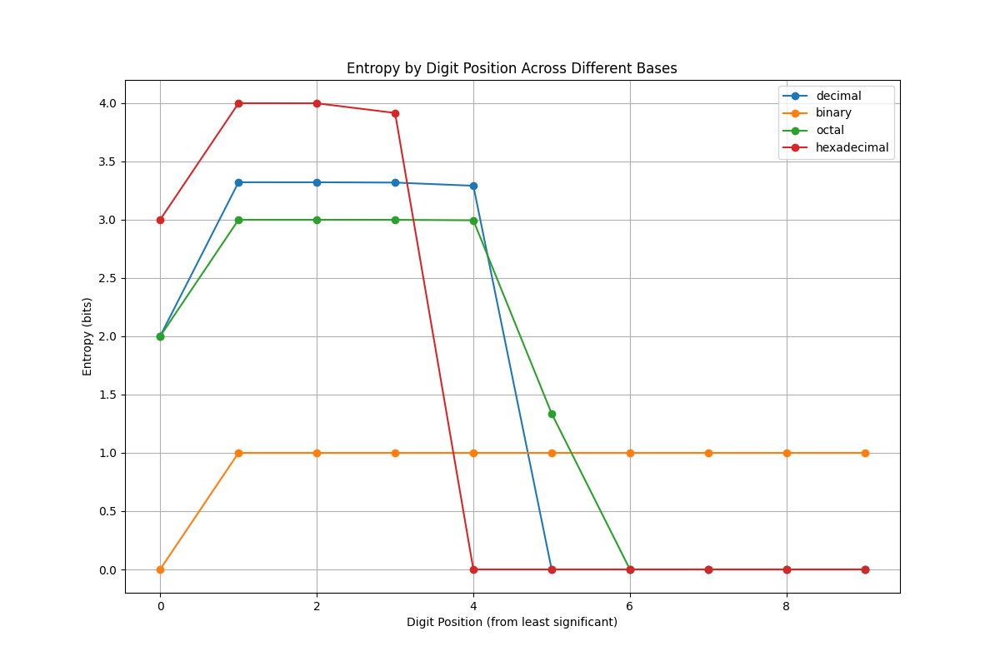
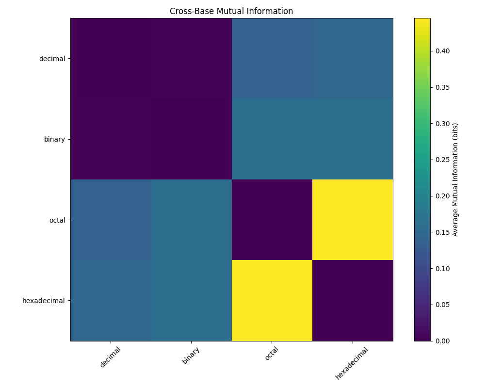
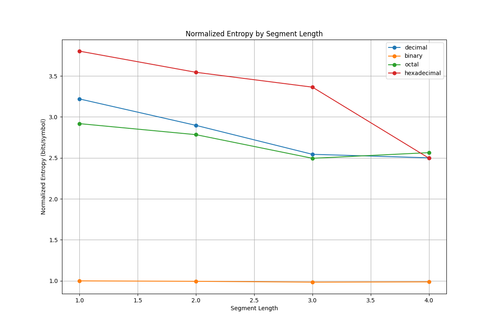
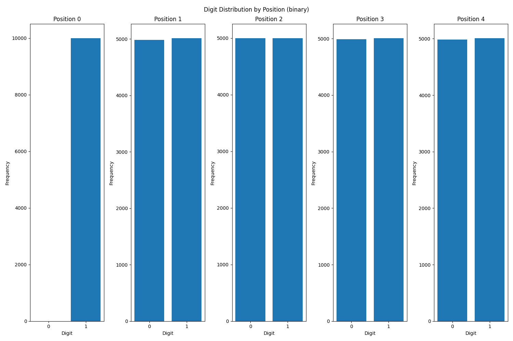
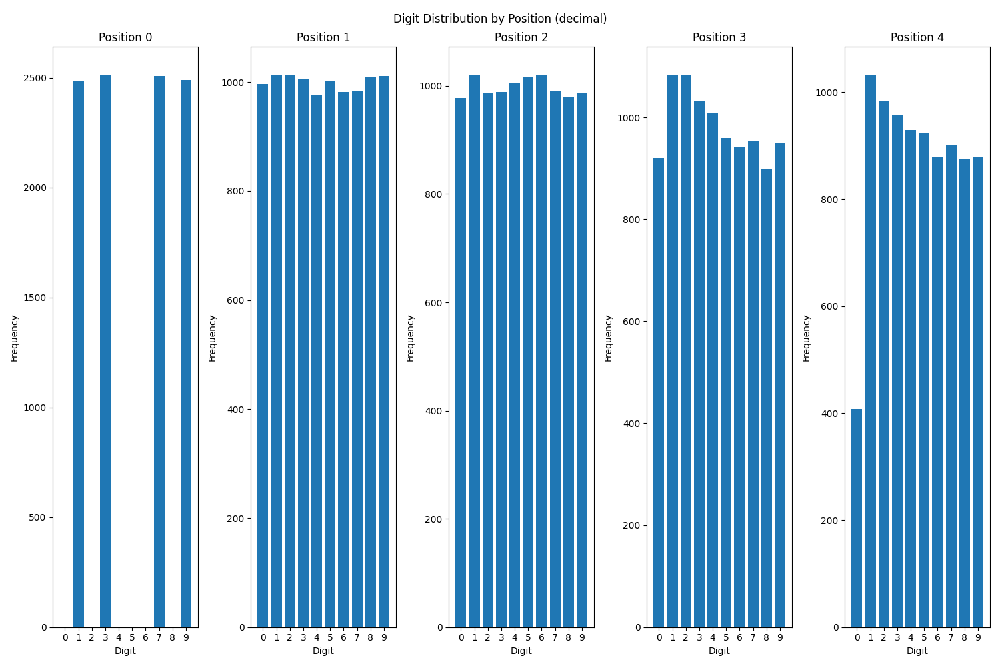
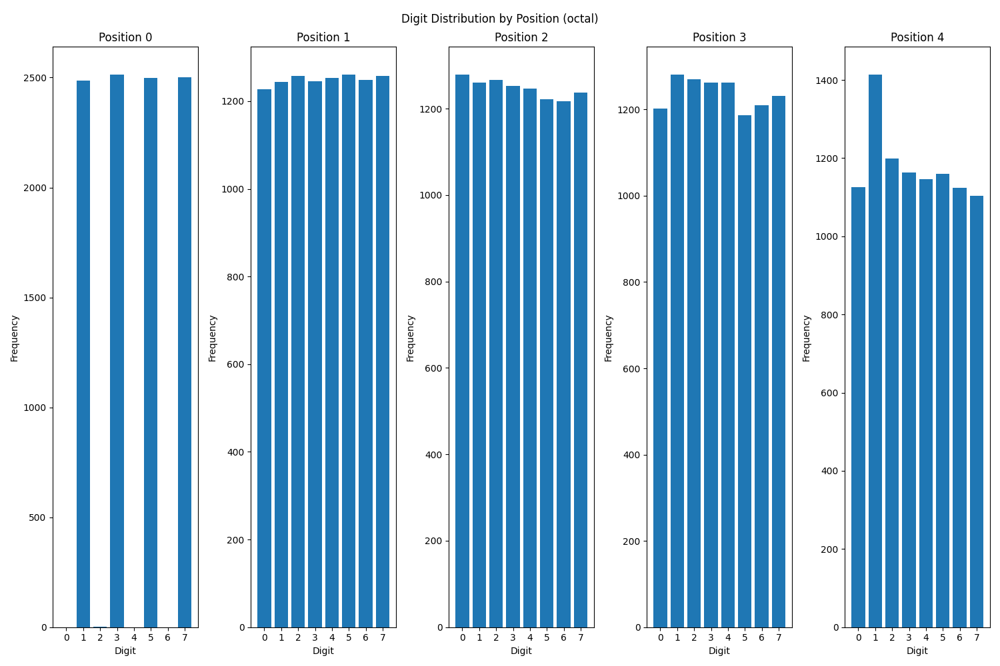
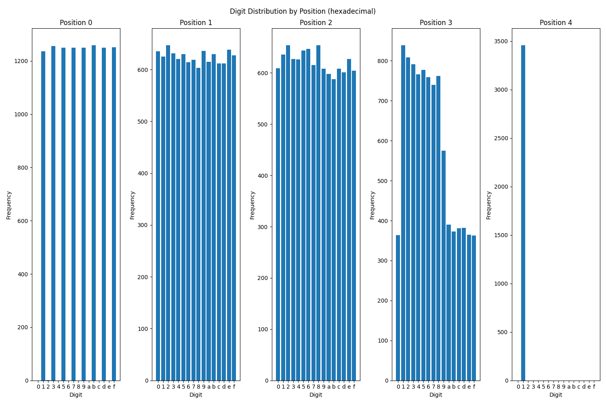

# Prime Number Pattern Analysis

This project applies information theory concepts to analyze patterns in prime numbers across different numerical base representations. By examining primes in decimal, binary, octal, and hexadecimal forms, we uncover non-conventional patterns and relationships that aren't immediately apparent through traditional mathematical approaches.

## Components

### 1. Prime Generation (`primes.py`)

This script generates prime numbers up to a specified limit and converts them to different base representations:

- **Functionality**:
  - Implements a memory-efficient segmented Sieve of Eratosthenes algorithm
  - Generates primes up to a user-specified limit (default: 1,000,000)
  - Converts primes to binary, octal, and hexadecimal representations
  - Writes results to separate files for each base

- **Key Features**:
  - Memory efficiency through segmentation for handling large ranges
  - Progress reporting for long-running calculations
  - Batch processing to avoid loading entire datasets into memory
  - Command-line options for customization

### 2. Pattern Analysis (`data_analysis_primes.py`)

This script analyzes the prime number files using information theory concepts:

- **Functionality**:
  - Calculates entropy, conditional entropy, and mutual information
  - Builds Markov chain models of digit transitions
  - Performs segmentation analysis to find optimal "chunking" units
  - Detects recurring patterns and high-information transitions
  - Analyzes cross-base relationships

- **Key Features**:
  - Batch processing for memory efficiency
  - Multiple information-theoretic metrics
  - Visualization generation
  - Detailed reporting of findings

## Information Theory Approach

The analysis applies several key concepts from information theory:

1. **Shannon Entropy**: Measures the "randomness" or information content in the digit distributions
2. **Conditional Entropy**: Examines how knowing previous digits reduces uncertainty about subsequent digits
3. **Mutual Information**: Quantifies relationships between digits at different positions or across different bases
4. **Surprisal**: Identifies unexpectedly rare transitions that carry high information content
5. **Segmentation Analysis**: Finds optimal ways to group digits to minimize entropy

## Key Visualizations

### Entropy by Digit Position



This visualization shows how entropy varies across digit positions in different bases. The non-uniform entropy distribution reveals that some positions in prime numbers are more constrained than others, suggesting underlying structural patterns.

### Cross-Base Mutual Information



This heatmap displays the mutual information between different base representations. Brighter colors indicate stronger relationships, revealing which base conversions preserve the most structural information about primes.

### Segmentation Entropy



This graph shows how normalized entropy changes with different segmentation lengths. The minima represent optimal "chunking" sizes for each base, suggesting natural units for analyzing prime number patterns.

### Digit Distributions by Position

#### Binary



#### Decimal



#### Octal



#### Hexadecimal



These visualizations show the frequency distribution of digits at different positions for each base. The non-uniform distributions, particularly in the least significant digits, reveal constraints in how prime numbers form.

## Key Findings

1. **Entropy Characteristics**:
   - Hexadecimal representation shows the highest relative entropy (3.9419/4.0000 bits)
   - Binary shows the lowest (0.9945/1.0000 bits)
   - All bases show entropy gradients across digit positions

2. **High-Information Transitions**:
   - Certain digit transitions are surprisingly rare, such as "99→e" in hexadecimal
   - These transitions may reveal structural constraints in prime formation

3. **Optimal Segmentation**:
   - Different bases have different optimal chunking lengths (decimal: 4, binary: 3, octal: 3, hexadecimal: 4)
   - These suggest natural "units" for analyzing prime structure

4. **Cross-Base Relationships**:
   - Strong mutual information between octal and hexadecimal representations
   - Suggests certain structural aspects are preserved or highlighted when converting between specific bases

5. **Common Patterns**:
   - The pattern "11" appears with high frequency across multiple bases
   - Suggests fundamental structural properties of prime numbers

## Usage

1. Generate prime numbers and their representations:

   ```bash
   python primes.py --limit 1000000
   ```

2. Analyze the patterns:

   ```bash
   python data_analysis_primes.py
   ```

## Further Exploration

The methodologies developed in this project can be applied to numerous other domains, including:

- Cryptography and security
- Genomics and bioinformatics
- Natural language processing
- Financial market analysis
- Quantum computing

See the accompanying `prime_patterns_analysis.md` for a detailed discussion of applications and future research directions.
